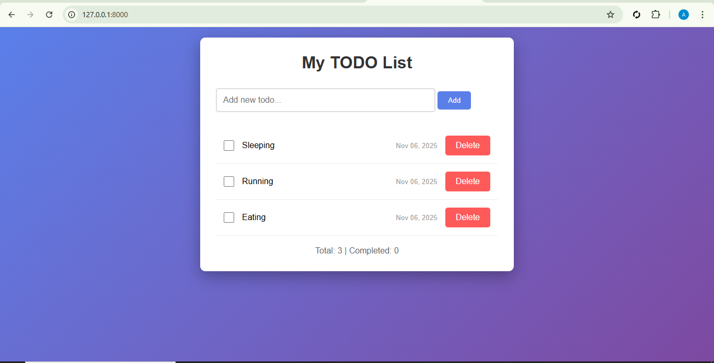
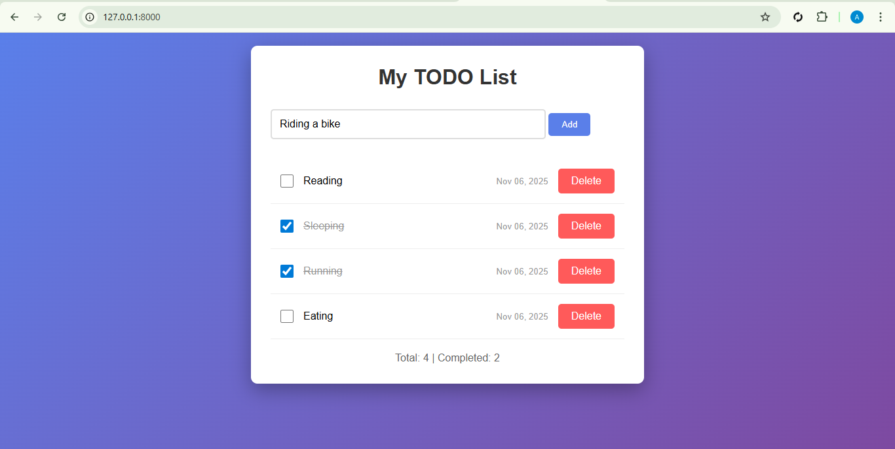
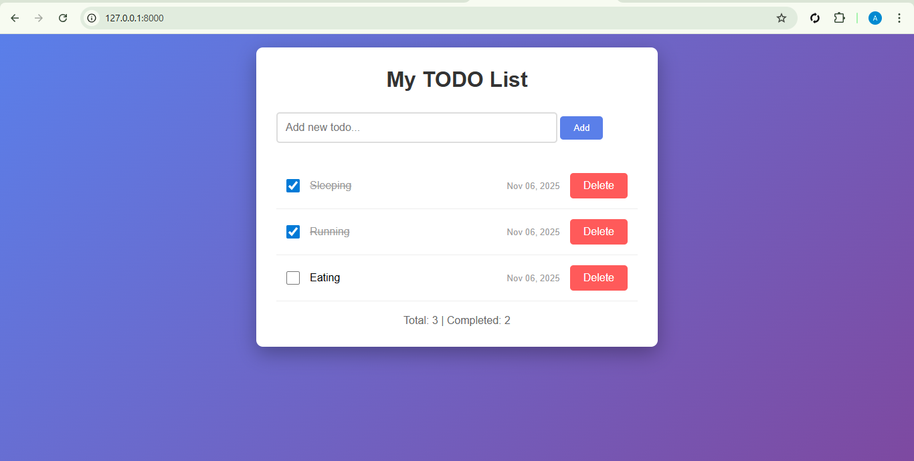
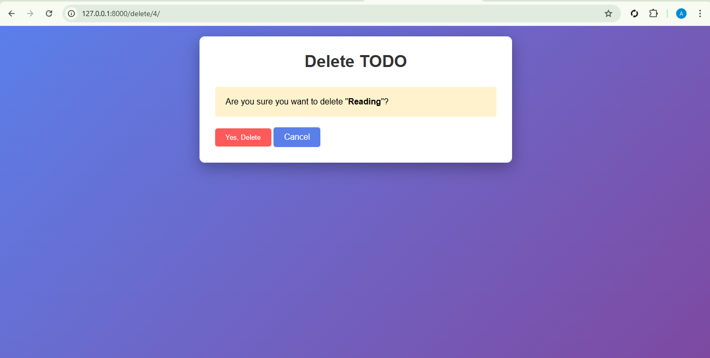

# 📝 Django Todo App

A simple **CRUD (Create, Read, Update, Delete)** Todo List built with **Django**, demonstrating models, class-based views, templates, and Bootstrap styling.

---

## 🚀 Features
- Add, edit, and delete tasks  
- Mark tasks as completed or pending  
- Display total and completed task counts  
- Clean and responsive UI  

---

## 📸 Screenshots

### 🏠 Homepage


### Adding Todo Page


### ✅ Completed Tasks


### Deleting Page

---

## ⚙️ Installation

### 1. Clone the repository
```bash
git clone https://github.com/dalyzhee/Django-Todo.git
cd Django-Todo
```

### 2. Running The code
```bash
### Install all dependencies:

pip install -r requirements.txt
```
